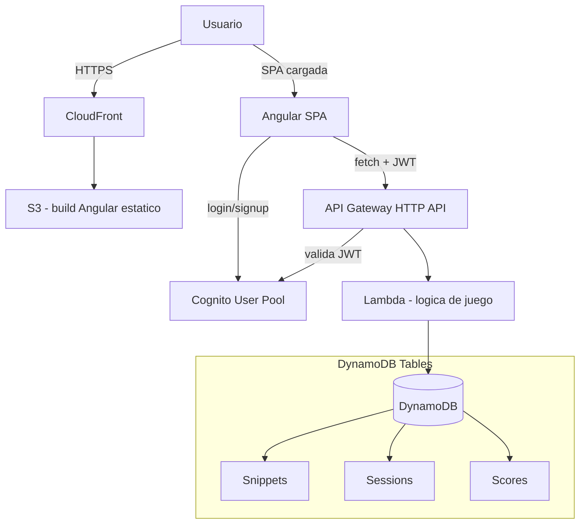

# Design Document: CodeGuessr MVP

## Overview

CodeGuessr es la única modalidad de juego del MVP de TechGuessr. El jugador ve un snippet de código anonimizado (sin nombres de archivo, comentarios reveladores ni referencias directas al proyecto) y juega una partida Clásica de 10 rondas. En cada ronda intenta adivinar, en cascada: (1) el lenguaje del snippet, (2) si acierta, el framework/librería, y (3) si acierta también esa, el proyecto de origen. El puntaje de la ronda combina precisión (cuántos de los 3 niveles acertó) y velocidad (tiempo de respuesta). Al terminar las 10 rondas se muestra un resumen y el puntaje total se guarda en una tabla de mejores puntajes simple (orden descendente, sin ELO).

El sistema es single-player, sin estado compartido entre jugadores durante la partida. La autenticación (Cognito) solo es necesaria para poder guardar el puntaje asociado a un usuario y aparecer en la tabla de mejores puntajes; no hay lógica de negocio de "sesión de partida" persistida en el servidor entre rondas más allá de lo necesario para evitar trampas triviales (ver Seguridad).

Este diseño cubre exclusivamente el alcance del MVP: sin multiplayer, sin otras modalidades, sin generación dinámica de contenido con Kiro en runtime. Kiro se usa únicamente offline para curar el dataset de snippets y para redactar las explicaciones post-ronda que se guardan junto a cada snippet en el dataset.

## Architecture

La arquitectura reutiliza el diagrama ya acordado en `docs/arquitectura.md`, con el detalle de los endpoints de la API de juego:



**Componentes de infraestructura (CDK, TypeScript, prefijo `techguessr-`):**

- `techguessr-frontend-stack`: bucket S3 + distribución CloudFront.
- `techguessr-auth-stack`: Cognito User Pool + User Pool Client.
- `techguessr-data-stack`: tablas DynamoDB (Snippets, Sessions, Scores).
- `techguessr-api-stack`: API Gateway HTTP API + Lambda(s) + integración con Cognito authorizer.

Para el tamaño del MVP se usa **una sola función Lambda** ("game function") con rutas internas por método/path, en vez de una Lambda por endpoint. Esto reduce la cantidad de recursos CDK y cold starts a gestionar por una sola persona en pocos días; se puede separar más adelante si el roadmap lo justifica.

## Components and Interfaces

### Frontend: `GameService` (Angular, signals)

**Propósito:** encapsular el estado de la partida en curso y la comunicación con la API. Es el único punto de acceso a los endpoints de juego; los componentes no llaman `fetch`/`HttpClient` directamente.

**Interfaz:**

```typescript
interface GameService {
  // Estado expuesto como signals de solo lectura para los componentes
  readonly currentRound: Signal<RoundView | null>;
  readonly roundIndex: Signal<number>; // 1..10
  readonly totalScore: Signal<number>;
  readonly sessionStatus: Signal<'idle' | 'playing' | 'finished'>;

  startSession(): Promise<void>;              // POST /sessions
  loadNextRound(): Promise<void>;              // GET /rounds/next
  submitAnswer(answer: AnswerSubmission): Promise<AnswerResult>; // POST /rounds/{id}/answer
  getSummary(): Promise<SessionSummary>;       // GET /sessions/{id}/summary
}
```

**Responsabilidades:**
- Mantener el `sessionId` activo y adjuntarlo en las llamadas.
- Traducir errores de red/API a un estado observable por la UI (sin lógica de puntaje: eso vive en el backend).

### Frontend: `AuthService` (envoltura sobre Cognito)

**Propósito:** registro, login, logout y exposición del JWT vigente para las llamadas HTTP.

**Interfaz:**

```typescript
interface AuthService {
  readonly currentUser: Signal<AuthenticatedUser | null>;
  signUp(email: string, username: string, password: string): Promise<void>;
  confirmSignUp(email: string, code: string): Promise<void>;
  login(email: string, password: string): Promise<void>;
  logout(): void;
  getIdToken(): Promise<string | null>;
}
```

**Responsabilidades:**
- Usar el SDK de Cognito (`amazon-cognito-identity-js`, flujo SRP) sin exponer detalles del SDK al resto de la app. Implementado en `src/app/core/auth.service.ts`.
- Adjuntar el JWT en un interceptor HTTP (`src/app/core/auth.interceptor.ts`) para todas las llamadas a la API de juego, salvo `GET /leaderboard`.

**Nota de implementación:** `amazon-cognito-identity-js` depende de paquetes pensados originalmente para Node.js (`buffer`), que asumen que existe la variable global `global`, inexistente en el navegador. Se agregó `src/polyfills.ts` (registrado en `angular.json`) que define `global = globalThis` antes de cargar el resto de la app.

### Backend: Lambda "game function" (.NET 10, C#)

**Propósito:** única función Lambda (.NET 10) que implementa la lógica de las 5 rutas de la API (ver Contrato de API). Internamente resuelve por `(method, path)` dentro de `Function.FunctionHandler` (ver `infra/lambda-dotnet/GameFunction/Function.cs`).

**Interfaz (por handler interno, expresada como contrato lógico — la implementación real usa tipos C#/records equivalentes):**

```typescript
interface GameHandlers {
  createSession(userId: string): Promise<SessionCreatedResponse>;
  getNextRound(userId: string, sessionId: string): Promise<RoundResponse>;
  submitAnswer(userId: string, sessionId: string, roundId: string, answer: AnswerSubmission): Promise<AnswerResult>;
  getSessionSummary(userId: string, sessionId: string): Promise<SessionSummary>;
  getLeaderboard(limit: number): Promise<LeaderboardEntry[]>;
}
```

**Responsabilidades:**
- Validar que el `userId` del JWT coincide con el propietario de la sesión antes de operar sobre ella (autorización a nivel de recurso).
- Nunca devolver al cliente el/los campo(s) de respuesta correcta de un snippet antes de que el jugador responda.
- Calcular el puntaje de la ronda en el servidor (el cliente nunca envía ni puede influir el puntaje final).

## Data Models

### Tabla DynamoDB: `techguessr-snippets`

Catálogo curado de snippets. Poblada inicialmente desde un JSON curado a mano (con apoyo de Kiro de forma offline) y luego importada a DynamoDB.

```typescript
interface SnippetItem {
  snippetId: string;        // PK
  code: string;             // snippet anonimizado, listo para mostrar
  language: string;         // respuesta correcta ronda 1, ej. "TypeScript"
  framework: string | null; // respuesta correcta ronda 2, null si no aplica
  project: string | null;   // respuesta correcta ronda 3, null si no aplica
  difficulty: 'easy' | 'medium' | 'hard';
  explanation: string;      // texto post-ronda (redactado con apoyo de Kiro, offline)
}
```

**Reglas de validación:**
- `code` no vacío y sin metadatos identificatorios (nombre de archivo, autor, URL del repo).
- Si `framework` es `null`, `project` debe ser `null` (no puede haber proyecto sin framework identificable en este dataset).
- `language`, `framework`, `project` se comparan con normalización simple (trim + case-insensitive) al validar respuestas.

### Tabla DynamoDB: `techguessr-sessions`

Representa una partida Clásica (10 rondas) en curso o finalizada.

```typescript
interface SessionItem {
  sessionId: string;   // PK
  userId: string;      // GSI para listar sesiones de un usuario
  status: 'in_progress' | 'finished';
  roundsPlayed: RoundRecord[]; // hasta 10 elementos, se va llenando
  totalScore: number;
  createdAt: string;   // ISO 8601
  finishedAt: string | null;
}

interface RoundRecord {
  roundId: string;
  snippetId: string;
  startedAt: string;
  answeredAt: string | null;
  guesses: {
    language: string | null;
    framework: string | null;
    project: string | null;
  };
  correctness: {
    language: boolean;
    framework: boolean | null; // null = no se llegó a esta sub-ronda
    project: boolean | null;
  };
  score: number; // puntaje obtenido en esta ronda
}
```

**Reglas de validación:**
- `roundsPlayed.length <= 10`; al llegar a 10 rondas respondidas, `status` pasa a `finished` y se calcula `finishedAt`.
- No se puede pedir una ronda nueva (`GET /rounds/next`) si la sesión ya está `finished`.
- No se puede responder dos veces la misma `roundId` (idempotencia: una segunda llamada a `answer` sobre una ronda ya respondida devuelve 409).

### Tabla DynamoDB: `techguessr-scores`

Tabla de mejores puntajes. Se escribe una entrada al finalizar cada sesión.

```typescript
interface ScoreItem {
  scoreId: string;     // PK
  userId: string;
  username: string;    // desnormalizado para no hacer join al leer el leaderboard
  totalScore: number;  // GSI ordenado por este campo, descendente
  sessionId: string;
  achievedAt: string;  // ISO 8601
}
```

**Reglas de validación:**
- `totalScore` es siempre el valor calculado por el servidor al finalizar la sesión (0-10 rondas × puntaje máximo por ronda), nunca un valor enviado por el cliente.
- El leaderboard expuesto por la API devuelve como máximo el top N (parámetro `limit`, default y máximo a definir en tasks, ej. 20) ordenado por `totalScore` descendente.

## Contrato de API

Todas las rutas (salvo que se indique lo contrario) requieren `Authorization: Bearer <JWT de Cognito>`, validado por el authorizer JWT de API Gateway antes de invocar la Lambda.

| Método | Ruta | Descripción |
|---|---|---|
| POST | `/sessions` | Crea una nueva sesión Clásica (10 rondas) para el usuario autenticado. |
| GET | `/rounds/next` | Devuelve la siguiente ronda pendiente de la sesión activa (snippet sin respuestas). |
| POST | `/rounds/{roundId}/answer` | Envía la(s) respuesta(s) del jugador para esa ronda; devuelve corrección y puntaje. |
| GET | `/sessions/{sessionId}/summary` | Devuelve el resumen final de una sesión finalizada. |
| GET | `/leaderboard` | Devuelve el top N de la tabla de mejores puntajes. Público (no requiere JWT). |

### `POST /sessions`

**Request:** sin body (el `userId` se obtiene del JWT).

**Response 201:**
```typescript
interface SessionCreatedResponse {
  sessionId: string;
  totalRounds: 10;
}
```

### `GET /rounds/next?sessionId={id}`

**Response 200:**
```typescript
interface RoundResponse {
  roundId: string;
  roundIndex: number;    // 1..10
  code: string;
  difficulty: 'easy' | 'medium' | 'hard';
  // NUNCA incluye language/framework/project reales
}
```

**Response 409** si la sesión ya está finalizada o si ya hay una ronda sin responder (debe responderse antes de pedir la siguiente).

### `POST /rounds/{roundId}/answer`

**Request:**
```typescript
interface AnswerSubmission {
  sessionId: string;
  guess: {
    language: string;
    framework?: string;  // solo se envía/considera si language fue correcto
    project?: string;    // solo se envía/considera si framework fue correcto
  };
  clientElapsedMs: number; // referencial; el tiempo autoritativo se mide server-side (ver Seguridad)
}
```

**Response 200:**
```typescript
interface AnswerResult {
  correctness: { language: boolean; framework: boolean | null; project: boolean | null };
  correctAnswers: { language: string; framework: string | null; project: string | null };
  explanation: string;
  roundScore: number;
  totalScoreSoFar: number;
  sessionFinished: boolean; // true si esta era la ronda 10
}
```

**Response 404** si `roundId` no existe o no pertenece a la sesión/usuario.
**Response 409** si la ronda ya fue respondida previamente.

### `GET /sessions/{sessionId}/summary`

**Response 200:**
```typescript
interface SessionSummary {
  sessionId: string;
  totalScore: number;
  rounds: RoundRecord[]; // las 10 rondas con detalle de aciertos y puntaje
  rank: number | null;   // posición actual en el leaderboard, si aplica
}
```

**Response 409** si la sesión aún está `in_progress`.

### `GET /leaderboard?limit={n}`

**Response 200:**
```typescript
interface LeaderboardEntry {
  username: string;
  totalScore: number;
  achievedAt: string;
}
// respuesta: LeaderboardEntry[]
```

## Lógica de Puntaje

Definida aquí porque es la regla de negocio central del MVP y varias secciones (modelos de datos, contrato de API) dependen de ella.

- Cada ronda tiene un puntaje máximo fijo (constante de configuración, ej. `MAX_ROUND_SCORE = 300`), repartido en 3 tramos (uno por sub-adivinanza: language, framework, project).
- Cada tramo acertado otorga puntos base + un bonus por velocidad (a mayor rapidez de respuesta medida server-side, mayor bonus, con un piso y techo definidos como constantes).
- Si `language` es incorrecto, la ronda termina inmediatamente en ese tramo: no se evalúan framework/project y esos campos de `correctness` quedan en `null`.
- Si un snippet no tiene `framework`/`project` definidos (`null` en el dataset), ese tramo se omite del cálculo y no resta ni suma puntaje.
- `totalScore` de la sesión es la suma de `roundScore` de las 10 rondas.
- Al registrar la respuesta de la ronda 10, la actualización de `roundsPlayed`, `status = 'finished'` y `finishedAt` se realiza en una única escritura atómica sobre el ítem de sesión en DynamoDB, para que no exista un estado intermedio observable con `roundsPlayed.length === 10` y `status === 'in_progress'`.

**Nota de implementación:** la atomicidad se logra con **optimistic locking** (no `UpdateItem` parcial): `SessionsRepository` (ver `infra/lambda-dotnet/GameFunction/Repositories/SessionsRepository.cs`) serializa `RoundsPlayed` como un único atributo JSON y reemplaza el ítem completo con `PutItem` + `ConditionExpression` sobre un atributo `version`. Si otra escritura concurrente ya incrementó `version`, la condición falla (`ConditionalCheckFailedException`) y el caller responde 409 al cliente en vez de corromper el estado.

Las constantes exactas (puntos base por tramo, curva de bonus por velocidad, límites de tiempo) se definen como configuración versionada junto al código de la Lambda, no hardcodeadas en múltiples lugares, para poder ajustarlas sin tocar lógica.

## Correctness Properties

Propiedades que debe cumplir la lógica de puntaje y de transición de estado de sesión, independientemente del framework de testing usado para verificarlas (ver también "Testing basado en propiedades" más abajo):

### Property 1: Rango de puntaje por ronda

Para toda combinación válida de aciertos/fallos en los 3 tramos (language, framework, project) y todo tiempo de respuesta dentro del rango permitido, se cumple `0 <= roundScore <= MAX_ROUND_SCORE`.

**Validates: Requirements 4.4**

### Property 2: Cascada de corrección

Para todo snippet y toda respuesta enviada, si `correctness.language === false` entonces `correctness.framework === null` y `correctness.project === null`.

**Validates: Requirements 4.2**

### Property 3: Omisión por dataset incompleto

Para todo snippet con `framework === null`, el tramo de framework (y por lo tanto el de project) nunca contribuye puntaje ni penalización al `roundScore`.

**Validates: Requirements 4.3**

### Property 4: Consistencia de la suma total

Para toda sesión finalizada, `totalScore === sum(roundsPlayed[i].score for i in 0..9)`.

**Validates: Requirements 6.4**

### Property 5: Idempotencia de respuesta

Para toda `roundId` ya respondida, una segunda llamada a `POST /rounds/{roundId}/answer` nunca modifica `roundScore`, `totalScore` ni `correctness` almacenados; responde 409 sin efectos secundarios.

**Validates: Requirements 4.8**

### Property 6: Límite de rondas

Para toda sesión, `roundsPlayed.length` nunca excede 10, y `status` pasa a `finished` si y solo si `roundsPlayed.length === 10`.

**Validates: Requirements 5.1, 5.3**

### Property 7: No filtración de respuesta

Para toda llamada a `GET /rounds/next`, la respuesta nunca contiene los campos reales `language`, `framework` o `project` del snippet devuelto.

**Validates: Requirements 3.2**

## Error Handling

| Escenario | Respuesta HTTP | Recuperación |
|---|---|---|
| JWT ausente o inválido | 401 | El frontend redirige a login; `AuthService` limpia el estado de sesión local. |
| Usuario intenta acceder a una sesión/ronda que no le pertenece | 403 | El frontend muestra error genérico y vuelve a la pantalla de inicio; no se filtra si el recurso existe. |
| `GET /rounds/next` sobre sesión finalizada o con ronda pendiente sin responder | 409 | El frontend usa la respuesta para redirigir al flujo correcto (resumen o responder pendiente) en vez de reintentar. |
| `POST /rounds/{id}/answer` sobre ronda ya respondida | 409 | El frontend trata la respuesta como informativa (idempotencia), no como fallo bloqueante. |
| `snippetId` referenciado por una ronda no existe en la tabla de snippets (dataset corrupto) | 500 | Se registra en logs de Lambda (CloudWatch); el frontend muestra error genérico y permite reintentar `loadNextRound`. |
| DynamoDB no disponible / throttling | 502/503 | El frontend reintenta una vez con backoff simple; si falla de nuevo, muestra error y permite reintentar manualmente. |
| Dataset con menos de 10 snippets utilizables (no debería ocurrir en producción) | 500 al crear sesión | Se valida en el pipeline de carga del dataset (fuera del alcance runtime), no en cada partida. |

Principio general: el frontend nunca decide autoridad de negocio (puntaje, corrección, estado de sesión) a partir de estados de error; siempre refleja lo que la API devuelve o pide reintentar.

## Testing Strategy

### Testing unitario

- **Lambda (.NET 10, lógica de puntaje y transiciones de estado):** casos por método puro (cálculo de puntaje por tramo, validación de transición `in_progress` → `finished`, normalización de respuestas de texto). Usar **xUnit** como framework de test runner.
- **Frontend (`GameService`, `AuthService`):** mockear las llamadas HTTP y verificar transiciones de signals (`sessionStatus`, `roundIndex`, `totalScore`) ante respuestas simuladas de la API, usando Vitest (test runner ya configurado en el proyecto Angular).

### Testing basado en propiedades

Aplicable principalmente a la lógica de puntaje y a la validación de transiciones de sesión, que son funciones puras con invariantes claras:

- **Invariante de puntaje:** para cualquier combinación de aciertos/fallos en los 3 tramos y cualquier tiempo de respuesta dentro de rango válido, `0 <= roundScore <= MAX_ROUND_SCORE`.
- **Invariante de cascada:** si `correctness.language === false`, entonces `correctness.framework === null` y `correctness.project === null` para cualquier input.
- **Invariante de suma:** `totalScore` de una sesión finalizada siempre es igual a la suma de `roundScore` de sus `roundsPlayed`, para cualquier secuencia de 10 rondas.

**Librería de property testing:** **FsCheck** (equivalente de `fast-check` en el ecosistema .NET), integrado con xUnit para la lógica de la Lambda. El frontend sigue usando `fast-check` (TypeScript) si se decide aplicar property testing ahí también.

### Testing de integración

- Contra la API desplegada en un entorno de desarrollo (stack CDK separado o mismo stack con sufijo de entorno): flujo completo `POST /sessions` → 10 × (`GET /rounds/next` + `POST /rounds/{id}/answer`) → `GET /sessions/{id}/summary` → verificar que aparece en `GET /leaderboard`.
- No se prevé un entorno de mocking de DynamoDB local (DynamoDB Local) dado el tamaño del MVP y la ventana de tiempo; los tests de integración corren contra recursos reales de desarrollo con datos de prueba aislados (prefijo de `userId`/`sessionId` de test) y se limpian manualmente o con un script simple de cleanup.

## Consideraciones de Seguridad

- El JWT de Cognito se valida en el authorizer de API Gateway antes de invocar la Lambda; la Lambda confía en el `sub`/`username` del claim ya validado, no revalida el token por su cuenta.
- El cliente nunca puede enviar un puntaje: todo puntaje se calcula server-side a partir del tiempo medido por el servidor entre `GET /rounds/next` (marca `startedAt`) y `POST /rounds/{id}/answer` (marca `answeredAt`). El `clientElapsedMs` del request es solo referencial/telemetría, no se usa para el cálculo.
- La respuesta de `GET /rounds/next` nunca incluye `language`/`framework`/`project` reales del snippet, para evitar que se puedan leer desde las herramientas de red del navegador antes de responder.
- Autorización a nivel de recurso: toda operación sobre una `sessionId`/`roundId` verifica que `session.userId === jwt.sub` antes de leer o escribir, para que un usuario no pueda ver ni alterar la partida de otro solo adivinando IDs.
- El endpoint `GET /leaderboard` es público (sin JWT) porque muestra datos ya no sensibles (username + puntaje), pero de solo lectura; no expone `userId` interno ni otros datos de cuenta.

## Consideraciones de Rendimiento

Dado el tamaño esperado de tráfico (demo de hackathon, no producción a escala), no se diseñan optimizaciones más allá de:
- Acceso a DynamoDB por clave primaria (snippets, sessions) o GSI simple (scores por `totalScore`, sessions por `userId`), evitando `Scan` en las rutas del flujo de juego. El `GET /leaderboard` puede usar `Query` sobre un GSI ordenado por `totalScore` sin necesidad de `Scan` completo.
- Selección aleatoria del siguiente snippet en `GET /rounds/next` mediante partición simple (ej. atributo `randomBucket` precalculado al cargar el dataset) en vez de `Scan` con filtro, para que el costo no crezca linealmente con el tamaño del dataset.

## Dependencias

- **Frontend:** Angular v22, TypeScript estricto, SCSS, Vitest (con `@angular/common/http/testing` para mocks de `GameService`), `amazon-cognito-identity-js` para autenticación Cognito (flujo SRP).
- **Lambda ("game function"):** .NET 10 (C#), `AWSSDK.DynamoDBv2` para acceso a DynamoDB, `Amazon.Lambda.APIGatewayEvents`/`Amazon.Lambda.Core` para el runtime de Lambda, xUnit + FsCheck para testing.
- **Script de carga del dataset (`infra/tools/SeedSnippets`):** .NET 10 (C#, consola), `AWSSDK.DynamoDBv2`.
- **Infraestructura:** AWS CDK (TypeScript) — el CDK en sí sigue en TypeScript; solo el código de negocio de la Lambda está en .NET. Empaquetado de la Lambda vía local bundling (`dotnet publish`, sin Docker).
- **AWS:** S3, CloudFront, API Gateway (HTTP API), Lambda (.NET 10), DynamoDB, Cognito (User Pool).
- **Dataset:** JSON curado a mano (16 snippets, offline, con apoyo de Kiro) en `src/app/data/snippets.json`, importado a `techguessr-snippets` mediante `infra/tools/SeedSnippets` (fuera del alcance de la Lambda de runtime).

## Estado de implementación

Todas las tareas de `.kiro/specs/codeguessr-mvp/tasks.md` están completas y desplegadas en AWS (cuenta `515788229331`, región `us-east-1`). Ver `docs/arquitectura.md`, sección "Estado actual", para las URLs y IDs de recursos reales.

**Desviaciones respecto a este diseño, documentadas en el código:**
- `techguessr-scores` tiene un atributo `leaderboardShard` no listado en `ScoreItem` — necesario porque DynamoDB exige partition key en todo GSI y el diseño original solo especificaba `totalScore` como sort key. No cambia el contrato de API observable.
- No se escribieron tests unitarios de `AuthService` (requeriría refactor para inyectar `CognitoUserPool` en vez de crearlo en el constructor). Deuda técnica conocida, no bloqueante para el MVP.
