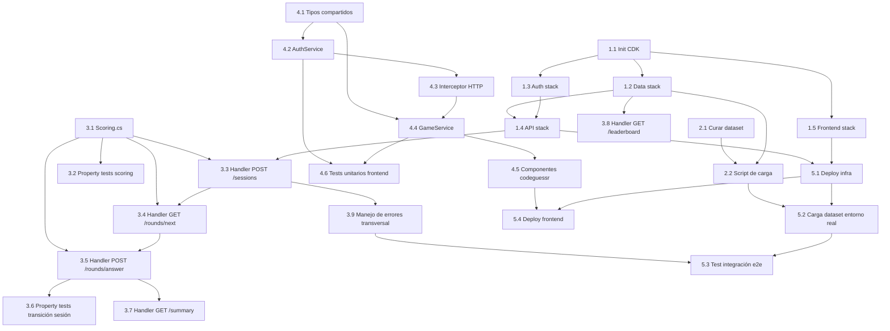

# Implementation Plan

## Overview

Plan de implementación del MVP de CodeGuessr: infraestructura CDK, dataset curado, lógica de juego en Lambda, frontend Angular e integración/despliegue. Pensado para 1 persona en una ventana de días, priorizando un flujo funcional de punta a punta sobre cobertura amplia de features.

## Tasks

### 1. Infraestructura base (CDK)

- [x] 1.1 Inicializar proyecto CDK en TypeScript
  - Crear carpeta `infra/` con `cdk.json`, `tsconfig.json` y dependencias fijas de `aws-cdk-lib`/`constructs`.
  - Configurar el `App` de CDK con las 4 stacks previstas: `techguessr-data-stack`, `techguessr-auth-stack`, `techguessr-api-stack`, `techguessr-frontend-stack`.
  - _Requirements: 1.1, 2.1_

- [x] 1.2 Stack de datos (`techguessr-data-stack`)
  - Definir tabla `techguessr-snippets` (PK `snippetId`) con atributo `randomBucket` para selección aleatoria sin `Scan`.
  - Definir tabla `techguessr-sessions` (PK `sessionId`, GSI por `userId`).
  - Definir tabla `techguessr-scores` (PK `scoreId`, GSI ordenado por `totalScore` descendente).
  - _Requirements: 2.1, 3.1, 5.4, 7.1_

- [x] 1.3 Stack de autenticación (`techguessr-auth-stack`)
  - Crear Cognito User Pool + User Pool Client (sin secreto de cliente, apto para SPA).
  - Configurar políticas de contraseña y verificación por email.
  - Exportar `userPoolId`/`clientId` para consumo del frontend y del authorizer de API Gateway.
  - _Requirements: 1.1, 1.2, 1.3_

- [x] 1.4 Stack de API (`techguessr-api-stack`)
  - Crear API Gateway HTTP API con JWT authorizer apuntando al User Pool de 1.3.
  - Crear la Lambda única "game function" (.NET 10, C#) con permisos IAM acotados a las tablas de 1.2.
  - Empaquetar la Lambda con local bundling (`dotnet publish`, sin Docker) vía `infra/lib/api-stack.ts`.
  - Registrar las 5 rutas del contrato de API con el authorizer aplicado salvo `GET /leaderboard`.
  - _Requirements: 1.6, 7.4, 8.1_

- [x] 1.5 Stack de frontend (`techguessr-frontend-stack`)
  - Crear bucket S3 privado + distribución CloudFront con origen S3 (OAC) y fallback de SPA a `index.html`.
  - _Requirements: (soporte de infraestructura, sin AC funcional directo)_

### 2. Dataset de snippets

- [x] 2.1 Curar dataset inicial en JSON
  - Redactar (con apoyo offline de Kiro) al menos 15-20 snippets anonimizados cubriendo varios lenguajes/frameworks/proyectos, con campo `explanation`.
  - Validar manualmente que `code` no contiene nombre de archivo, autor ni URL de repo.
  - Validar que si `framework` es `null`, `project` también es `null`.
  - _Requirements: 10.1, 10.2, 10.3, 10.4_

- [x] 2.2 Script de carga a DynamoDB
  - Escribir un pequeño programa/script .NET (o `dotnet script`/consola) que lea el JSON de 2.1, calcule `randomBucket` y haga `BatchWriteItem` a `techguessr-snippets` usando `AWSSDK.DynamoDBv2`.
  - Validar en el script que el dataset tiene al menos 10 snippets utilizables antes de cargar.
  - _Requirements: 2.3, 10.1_

### 3. Backend: lógica de juego (Lambda, .NET 10/C#)

- [x] 3.1 Módulo de puntaje puro (`Scoring.cs`)
  - Implementar método estático `CalculateRoundScore(guess, correctAnswers, elapsedMsServer)` que devuelve un record `(Correctness, RoundScore)`.
  - Implementar la cascada: si `language` es incorrecto, `framework`/`project` quedan en `null` y no se evalúan.
  - Implementar la omisión de tramo cuando `framework` del snippet es `null`.
  - Implementar comparación normalizada (trim + case-insensitive, `StringComparer.OrdinalIgnoreCase`).
  - _Requirements: 4.1, 4.2, 4.3, 4.4, 4.5_

- [x] 3.2 Property tests del módulo de puntaje (FsCheck)
  - Property: para toda combinación de aciertos/fallos y tiempo dentro de rango válido, `0 <= roundScore <= MAX_ROUND_SCORE`.
  - Property: si `correctness.language == false`, entonces `correctness.framework == null` y `correctness.project == null`.
  - Property: si el snippet tiene `framework == null`, ese tramo nunca contribuye puntaje.
  - _Requirements: 4.2, 4.3, 4.4_

- [x] 3.3 Handler `POST /sessions`
  - Crear ítem de sesión con `status = 'in_progress'`, `roundsPlayed = []`, `userId` del JWT.
  - Validar que hay al menos 10 snippets utilizables antes de crear la sesión; responder 500 si no.
  - _Requirements: 2.1, 2.2, 2.3_

- [x] 3.4 Handler `GET /rounds/next`
  - Verificar propiedad de la sesión (`session.userId === jwt.sub`), responder 403 si no coincide.
  - Responder 409 si la sesión está `finished` o si hay una ronda pendiente sin responder.
  - Seleccionar snippet aleatorio vía `randomBucket` (sin `Scan`), crear `RoundRecord` con `startedAt` server-side.
  - Excluir explícitamente `language`, `framework`, `project` del payload de respuesta.
  - _Requirements: 3.1, 3.2, 3.3, 3.4, 3.5, 8.1, 8.2_

- [x] 3.5 Handler `POST /rounds/{roundId}/answer`
  - Verificar propiedad de la sesión/ronda; responder 404 si `roundId` no existe o no pertenece; 403 si la sesión no pertenece al usuario.
  - Responder 409 sin efectos secundarios si la ronda ya fue respondida (idempotencia).
  - Calcular `answeredAt` server-side, invocar `Scoring.CalculateRoundScore`, y persistir el resultado con una escritura atómica (`UpdateItem` condicional).
  - Si es la ronda 10: en la misma escritura atómica, marcar `status = 'finished'`, `finishedAt`, y disparar la escritura de la entrada en `techguessr-scores`.
  - Ignorar `clientElapsedMs` para el cálculo de puntaje (solo se persiste como telemetría referencial).
  - _Requirements: 4.1, 4.4, 4.5, 4.6, 4.7, 4.8, 5.1, 5.2, 5.3, 5.4, 8.1, 8.2_

- [x] 3.6 Property tests de transición de sesión (FsCheck)
  - Property: para cualquier secuencia de 10 rondas respondidas, `roundsPlayed.length` nunca excede 10 y `status` pasa a `finished` si y solo si `roundsPlayed.length === 10`.
  - Property: `totalScore` de una sesión finalizada es igual a la suma de `roundScore` de sus `roundsPlayed`.
  - Property: no existe estado intermedio observable con `roundsPlayed.length === 10` y `status === 'in_progress'`.
  - _Requirements: 5.1, 5.3, 6.4_

- [x] 3.7 Handler `GET /sessions/{sessionId}/summary`
  - Verificar propiedad de la sesión; responder 403 si no coincide, 409 si `status !== 'finished'`.
  - Calcular `rank` consultando la posición en `techguessr-scores` (best-effort, `null` si no aplica).
  - _Requirements: 6.1, 6.2, 6.3, 6.4_

- [x] 3.8 Handler `GET /leaderboard`
  - Ruta pública (sin JWT) que hace `Query` sobre el GSI de `totalScore` en `techguessr-scores`.
  - Aplicar `limit` con valor por defecto y máximo configurados como constantes; devolver solo `username`, `totalScore`, `achievedAt`.
  - _Requirements: 7.1, 7.2, 7.3, 7.4_

- [x] 3.9 Manejo de errores transversal
  - Middleware/wrapper común en la Lambda para mapear errores de DynamoDB (throttling/no disponible) a 502/503.
  - Registrar en logs (CloudWatch) los casos de `snippetId` inexistente referenciado por una ronda, respondiendo 500.
  - _Requirements: 9.1, 9.2_

### 4. Frontend Angular

- [x] 4.1 Tipos compartidos (`shared/types`)
  - Definir interfaces TypeScript para `Snippet`, `RoundResponse`, `AnswerSubmission`, `AnswerResult`, `SessionSummary`, `LeaderboardEntry` alineadas al contrato de API del diseño.
  - _Requirements: 3.1, 4.6, 6.1, 7.2_

- [x] 4.2 `AuthService`
  - Implementar signUp/confirmSignUp/login/logout/getIdToken usando el SDK de Cognito elegido.
  - Exponer `currentUser` como signal; manejar rechazo de credenciales inválidas sin revelar si el email existe.
  - _Requirements: 1.1, 1.2, 1.3, 1.4, 1.5_

- [x] 4.3 Interceptor HTTP de autenticación
  - Adjuntar el JWT vigente (`Authorization: Bearer`) en llamadas a la API de juego; omitirlo en `GET /leaderboard`.
  - Redirigir a login ante 401 y limpiar el estado de sesión local.
  - _Requirements: 1.5, 1.6_

- [x] 4.4 `GameService`
  - Implementar `startSession`, `loadNextRound`, `submitAnswer`, `getSummary` consumiendo los endpoints correspondientes.
  - Exponer `currentRound`, `roundIndex`, `totalScore`, `sessionStatus` como signals de solo lectura.
  - Traducir respuestas 403/409/404/500/502/503 a un estado observable por la UI sin inferir puntaje/corrección en el cliente.
  - _Requirements: 3.1, 3.3, 3.4, 3.5, 4.6, 4.7, 4.8, 9.3_

- [x] 4.5 Componentes de la feature `codeguessr`
  - Pantalla de login/registro (usa `AuthService`).
  - Pantalla de ronda: muestra `code`, formulario en cascada (lenguaje → framework → proyecto según corrección previa), envía respuesta.
  - Pantalla de resumen final: muestra las 10 rondas, `totalScore`, `rank`.
  - Pantalla de leaderboard: lista `GET /leaderboard` sin requerir login.
  - _Requirements: 3.1, 4.6, 6.1, 7.1, 7.2_

- [x] 4.6 Tests unitarios de `GameService`/`AuthService`
  - Mockear HTTP y verificar transiciones de signals ante respuestas simuladas (éxito y cada código de error relevante).
  - _Requirements: 9.3_

### 5. Integración y despliegue

- [x] 5.1 Build y despliegue de infraestructura
  - Ejecutar `cdk deploy` de las 4 stacks en orden de dependencia (datos/auth → api → frontend) usando el usuario IAM acotado a `techguessr-*`.
  - _Requirements: (soporte de infraestructura)_

- [x] 5.2 Carga del dataset en el entorno desplegado
  - Ejecutar el script de 2.2 contra la tabla real `techguessr-snippets`.
  - _Requirements: 10.1_

- [x] 5.3 Test de integración end-to-end
  - Contra la API desplegada: `POST /sessions` → 10× (`GET /rounds/next` + `POST /rounds/{id}/answer`) → `GET /sessions/{id}/summary` → verificar aparición en `GET /leaderboard`.
  - Usar `userId`/`sessionId` de prueba aislados y limpiar manualmente al terminar.
  - _Requirements: 2.1, 3.1, 4.6, 5.2, 6.1, 7.1_

- [x] 5.4 Build y despliegue del frontend
  - Generar build de producción de Angular y sincronizarlo al bucket S3; invalidar caché de CloudFront.
  - _Requirements: (soporte de infraestructura)_

## Task Dependency Graph



```json
{
  "waves": [
    { "wave": 1, "tasks": ["1.1"] },
    { "wave": 2, "tasks": ["1.2", "1.3", "1.5", "2.1"] },
    { "wave": 3, "tasks": ["1.4", "2.2", "3.1"] },
    { "wave": 4, "tasks": ["3.2", "3.3", "3.8", "4.1"] },
    { "wave": 5, "tasks": ["3.4", "4.2"] },
    { "wave": 6, "tasks": ["3.5", "4.3"] },
    { "wave": 7, "tasks": ["3.6", "3.7", "3.9", "4.4"] },
    { "wave": 8, "tasks": ["4.5"] },
    { "wave": 9, "tasks": ["4.6", "5.1"] },
    { "wave": 10, "tasks": ["5.2", "5.4"] },
    { "wave": 11, "tasks": ["5.3"] }
  ]
}
```

## Notes

- Las tareas 3.2 y 3.6 son tareas de property-based testing (FsCheck, equivalente a fast-check en el ecosistema .NET) y deben ejecutarse y reportarse con el estado correspondiente (passed/failed) antes de marcarse completas.
- El orden recomendado de ejecución sigue el grafo de dependencias: infraestructura de datos/auth antes de API, lógica de scoring antes de los handlers que la consumen, y despliegue solo después de que los handlers y componentes relevantes existan.
- Dado el alcance de hackathon (1 persona, ventana de días), no se incluyen tareas de optimización de performance más allá de lo ya cubierto en el diseño (acceso por clave primaria/GSI, sin `Scan`).
